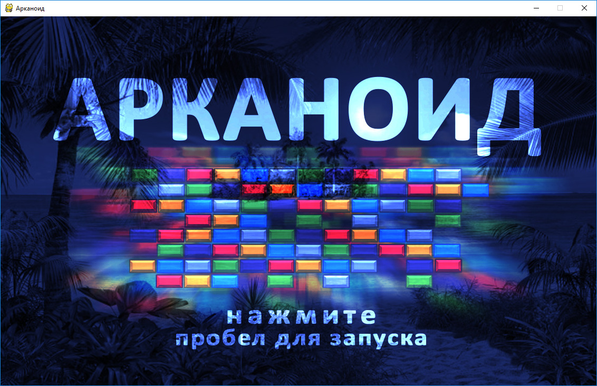
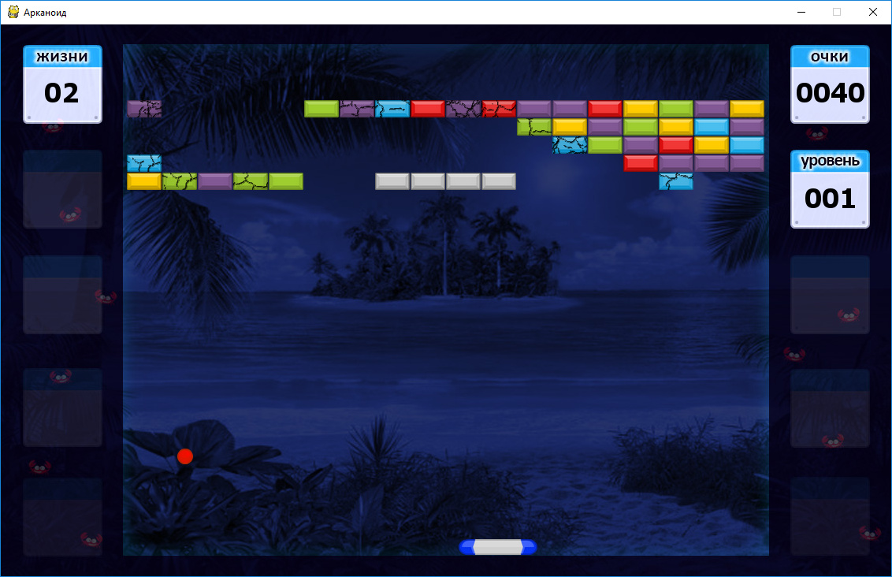
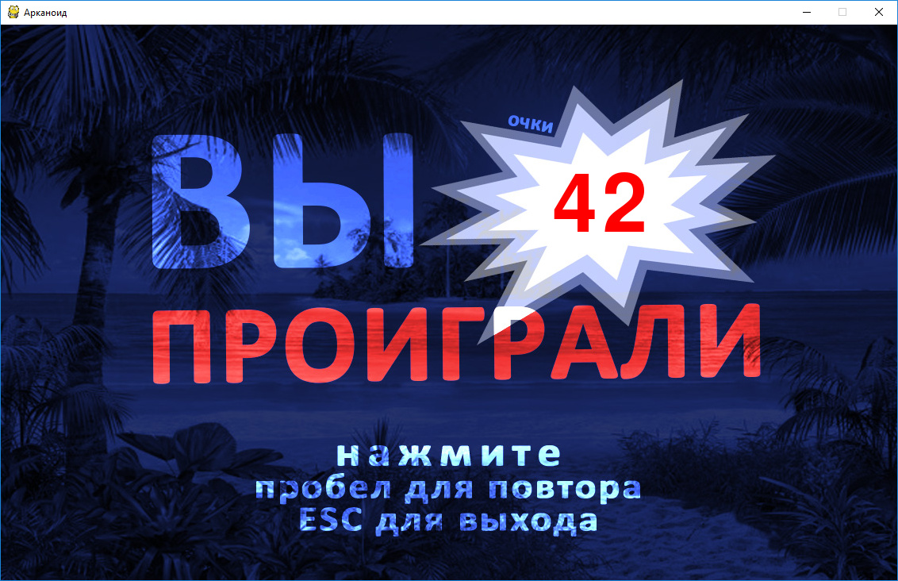

Арканоид
========

   

Для запуска приложения выполните следующие команды
```console
> git clone https://github.com/nikitakarak/arkanoid.git
> cd arkanoid
> python main.py
```

## Игровой процесс

Цель игры заключается в разбивании шариком кирпичей. При разбивании каждого кирпича игроку добавляется одно очко. Кирпичи бывают двух типов ― обычные и неразрушаемые. Обычный кирпич трескается после первого и второго попадания, а после третьего полностью разрушается. При уничожении всех кирпичей на текущем уровне автоматически загружается следующий уровень. После прохождения всех уровней игра завершается победой.

Шарик отскакивает от верхней и боковых границ игрового поля, но может провалиться за нижнюю.

Перемещение платформы выполняется клавишами со стрелками ← и →. Если шарик падает мимо платформы, то счётчик жизней уменьшается и при достижении 0 игра завершается поражением.

## Архитектура приложения

Приложение состоит из следующих основных блоков:
- игра (базовый класс _arkanoid.core.Game_ и класс _arkaniod.Arkanoid_);
- этап игры (базовый класс _arkanoid.core.Stage_ и классы _arkanoid.IntroStage_, _arkanoid.GameStage_ и _arkanoid.OutroStage_);
- объекты игрового мира: шарик (класс _arkanoid.core.Ball_), кирпич (базовый класс _arkanoid.core.Brick_ и классы _arkanoid.core.NormalBrick_ и _arkanoid.core.IndestructibleBrick_), платформа (класс _arkanoid.core.Paddle_).

В блоке _Игра_ создаются этапы и в основном цикле вызываются методы текущего _Этапа_. В блоке _Этап_ создаются объекты игрового мира и находится логика их взаимодействия. Объекты игрового мира отвечают за свою отрисовку и обработку событий.

## Возможные доработки

- Изменить алгоритм расчёта столновений шарика с кирпичами. Вместо [pygame.sprite.spritecollide](https://www.pygame.org/docs/ref/sprite.html?highlight=collide#pygame.sprite.spritecollide) нужно использовать проверку столкновения шарика отдельно с каждой гранью кирпича, чтобы задавать разное направление отскока для вертикальных и горизонтальных граней.

## Использованные материалы

- *main_theme_01.wav* (музыкальная тема для intro и outro)<br>
credit me as @wyver9 (also you can add link to my Twitter or Bandcamp)
https://opengameart.org/content/good-mood-theme-8-bit

- *The Undefeated - Chiptune Comp 06 - Long Track.ogg* (музыкальная тема для уровней)<br>
Music by Oblidivm https://oblidivmmusic.blogspot.com
https://opengameart.org/content/chiptune-music-for-arcade-games

- *Puzzle Pack* (шарик, платформа и кирпичи)<br>
Puzzle game graphics by Kenney Vleugels (www.kenney.nl)
https://www.kenney.nl/assets/puzzle-pack

- *Клипарт HiClipart*<br>
HiClipart is an open community for users to share PNG images,
all PNG cliparts in HiClipart are for Non-Commercial Use, no attribution required.
https://www.hiclipart.com/free-transparent-background-png-clipart-dojmh

- *Изображение краба*<br>
http://jurac.spb.ru/image/7681-0.html
