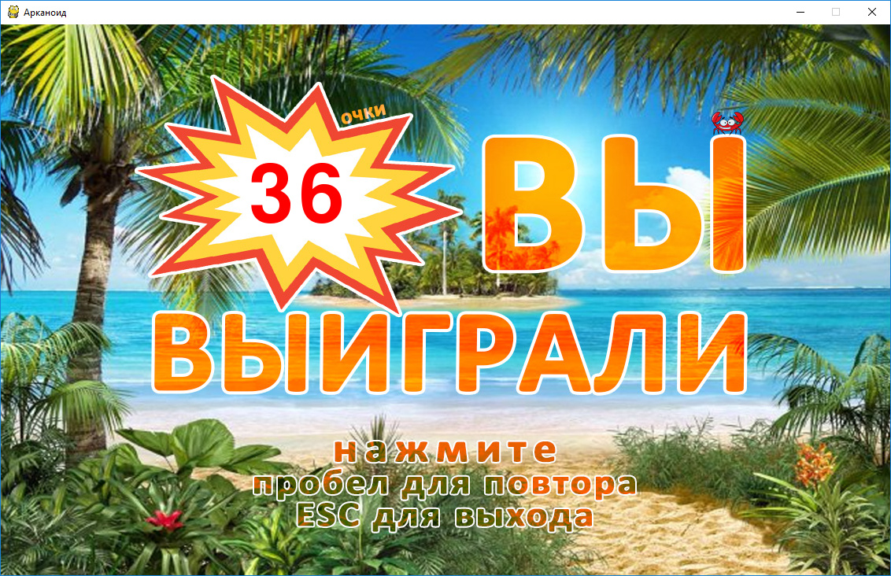

Арканоид
========

   

## Описание

Для запуска приложения необходимо выполнить следующие команды
```console
> cd arkanoid
> python3 main.py
```

### Игровой процесс

Цель игры заключается в разбивании шариком кирпичей. При разбивании каждого кирпича игроку добавляется одно очко. Кирпичи бывают двух типов ― обычные и неразрушаемые. Обычный кирпич трескается после первого и второго попадания, а после третьего полностью разрушается. При уничожении всех кирпичей на текущем уровне автоматически загружается следующий уровень. После прохождения всех уровней игра завершается победой.

Шарик отскакивает от верхней и боковых границ игрового поля, но может провалиться за нижнюю.

Перемещение платформы выполняется с помощью клавишь со стрелками ← и →. Если шарик падает мимо платформы, то счётчик жизней уменьшается и при достижении 0 игра завершается поражением.

### Архитектура приложения

Раздел не заполнен.

### Возможные доработки

Раздел не заполнен.

## Использованные материалы

- *main_theme_01.wav* (музыкальная тема для intro и outro)
credit me as @wyver9 (also you can add link to my Twitter or Bandcamp)
https://opengameart.org/content/good-mood-theme-8-bit

- *The Undefeated - Chiptune Comp 06 - Long Track.ogg* (музыкальная тема для уровней)
Music by Oblidivm https://oblidivmmusic.blogspot.com
https://opengameart.org/content/chiptune-music-for-arcade-games

- *Puzzle Pack* (шарик, платформа и кирпичи)
Puzzle game graphics by Kenney Vleugels (www.kenney.nl)
https://www.kenney.nl/assets/puzzle-pack

- *Клипарт HiClipart*
HiClipart is an open community for users to share PNG images,
all PNG cliparts in HiClipart are for Non-Commercial Use, no attribution required.
https://www.hiclipart.com/free-transparent-background-png-clipart-dojmh

- *Изображение краба*
http://jurac.spb.ru/image/7681-0.html
